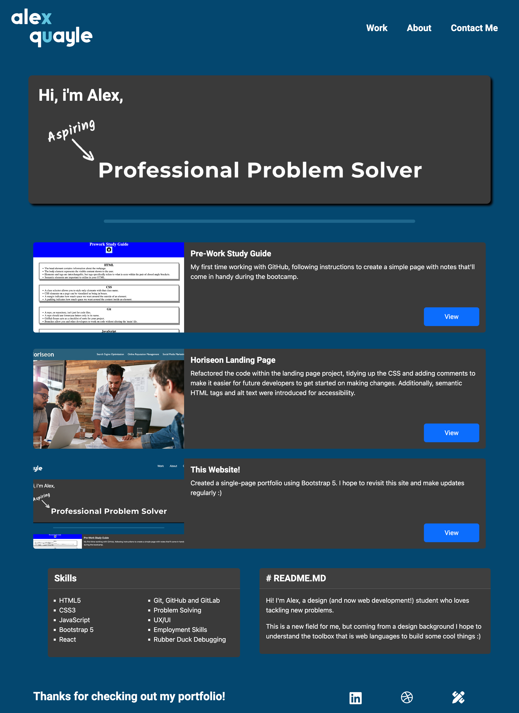

# Portfolio (Recreated With Bootstrap)

## Description

This project is a recreation of my previously made webpage, this time utilising Bootstrap components and grid system. I found this not only to be a massive timesaver, but a framework that helped build my confidence with layout systems, helping me understand Flexbox a little better and introducing me to Bootstrap grid, a third option for layouts going forward.

I chose to keep the same layout as the previous portfolio, as I had spent a lot of time visually designing the layout. With the time I saved, I plan to work on some projects to populate the portfolio with.

## Installation

No installation necessary. Please visit https://alex-quayle.github.io/bootstrap-portfolio/ to view the webpage. Below is a screenshot of the deployed page:

## Credits

### Social Link Icons

> Dribbble. (n.d.). dribbble logo [ logo ]. Font Awesome. https://fontawesome.com/icons/dribbble?f=brands&s=solid.

> Font Awesome. (n.d.). pen-ruler [ logo ]. Font Awesome. https://fontawesome.com/icons/pen-ruler?f=classic&s=solid.

> LinkedIn Corporation. (n.d.). linkedin logo [ logo ]. Font Awesome. https://fontawesome.com/icons/linkedin?f=brands&s=solid.

### Learning Resources Utilised

In addition to the following links, the class sessions held by the edX front-end bootcamp team have been invaluable for this challenge in my understanding of how to install, use and customise Bootstrap 5. Additionally, I re-used previous styling values, images and text copy from the previous challenge. For reference, that project can be found here: https://github.com/Alex-Quayle/web-development-portfolio

> Bootstrap (n.d.) Cards. https://getbootstrap.com/docs/5.3/components/card/.

> Bootstrap (n.d.) Columns. https://getbootstrap.com/docs/5.3/layout/columns/.

> Bootstrap (n.d.) Grid System. https://getbootstrap.com/docs/5.3/layout/grid/.

> Bootstrap (n.d.) Spacing. https://getbootstrap.com/docs/5.3/utilities/spacing/.

> DevSprout. (2023, January 3). How to Use Google Fonts 2023. https://www.youtube.com/watch?v=uebo3MsVSe0.

> Mozilla Developers Network (2023, September 25). box-shadow. https://developer.mozilla.org/en-US/docs/Web/CSS/box-shadow.

> Robertson, C. (n.d.). Roboto. https://fonts.google.com/specimen/Roboto.

> W3Schools (n.d.). CSS Lists. https://www.w3schools.com/css/css_list.asp.

> W3Schools (n.d.). How TO - Divider. https://www.w3schools.com/howto/howto_css_dividers.asp.
